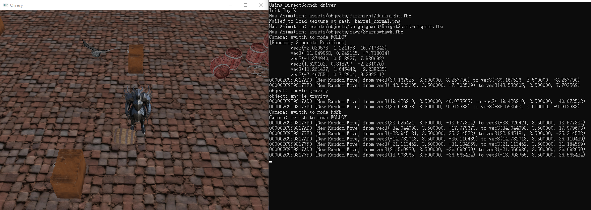

# Escape Dungeon

基于可编程管线OpenGL API实现的简单游戏交互界面，实现功能如下：

- 窗口显示与交互回调函数设置(窗口调整等)：GLFW库
- 相机设置与移动，当前设置为FOLLOW模式，可通过按键切换模式
- 常用模型导入与显示，带骨骼和动画的模型导入：ASSIMP库
  - 导入静态模型可使用obj，动态模型可用dae, fbx等
  - 支持动画播放的顶点着色器
  - 支持普通或Blinn-Phong光照模型的片段着色器（需与所选导入模型配合，当前未使用光照）
- 背景音乐和动作音效播放：IrrKlang库
- 物理效果模拟与碰撞检测：PhysX库
  - 使用静态刚体和动态刚体，玩家为运动学刚体




#### 作业得分点对照

> 仅提供参考，建议自己再仔细校对一下

To Pass：**40**（需确认）

| 条目                                                | 完成情况                                                     |
| --------------------------------------------------- | ------------------------------------------------------------ |
| Use C++                                             | 符合                                                         |
| Have report and git with readme                     | 符合：**You TODO** 所以是要求README的，记得自己写一个        |
| Submit 10 min                                       | **You TODO**                                                 |
| Code compiles with GL window<br />and basic polygon | 符合，不过项目中已经没有基本polygon了，都是用导入的模型，Triangle Mesh |
| Signature on scene                                  | 符合，加上了，并且是mixed texture的形式                      |
| No plagiarism                                       | 符合，注意一下报告中写下引用参考的内容                       |

40-70：**30**  *（吐槽：这里说caps at 30%有什么意义吗？总共不就30）*

| 条目                                | 完成情况                                                     |
| ----------------------------------- | ------------------------------------------------------------ |
| MVP implemented                     | 5/2.5：**TO CHECK** 稍微有点困惑顶点着色器实现具体指什么<br />目前项目是将MVP分别传入(还有bone的M)着色器中，在着色器中做乘法 |
| Textures                            | 5：其实实现本身就是支持mixed，是我忘了；单独为添加的signature制作了mixed的纹理，这下应该有了 |
| 3D Polygons with scene animation    | 5：有循环自动播放的动画(knightguard和随机飞的spawl)，有条件播放的动画(Player的走路动画) |
| Keyboard and mouse movement         | 5：键盘和鼠标都有，可通过键盘C切换模式，FREE模式下鼠标移动可控制镜头转向，可提现丝滑度 |
| Load model(s) with textures         | 5：自然，同时也是多格式，obj/fbx，其实删去的vampire时dae（但应该无所谓） |
| Procedural content generation (PCG) | 5：高度区分，有地面物体和空中飞鸟，同时初始化的barrel高度也不一样<br />随机生成不冲突的位置，也有不同物种 barrel 和 box 等； |

Aesthetic：**5** （先这么认为吧，虽然确实不好看）

Advanced：**7.5+**

| 条目                            | 完成情况                                                     |
| ------------------------------- | ------------------------------------------------------------ |
| Mixed textures                  | 0：无，但是2.5的normal map感觉可以考虑，半成型               |
| Model animation in assimp       | 2.5+：single torus是指单一循环的动画吗，不过主角的也只有走路一种动画 |
| Interaction/adjust model params | 0：**TO CHECK**，如果是按某个键调整模型参数的话，干脆就影响最简单的scale，2.5似乎实现比较容易 |
| BlinnPhong/PBR lighting         | 0：其实可以有，但没应用，因为不同模型的贴图未必够            |
| Audio                           | 5：有BGM，和走路时的声音                                     |

Last 10%：**0**

Penalties：**-5？**

| 条目                                        | 情况                                                         |
| ------------------------------------------- | ------------------------------------------------------------ |
| Using other libraries without authorisation | -0：哦哦原来说了learnopengl.com上的不算                      |
| Final outcome differs too much from pitch   | -? : 感觉还是有好大差距的，毕竟没有游戏性                    |
| No OOP paradigm in main CPP                 | -0：我认为还是基本OOP的，虽有有些结构因为匆忙比较silly       |
| Insufficient internal documentation         | -? ：You TODO                                                |
| Insufficient error handling                 | -0?：实在不行PhysX的实例就生成一个动态刚体，这样就不会不稳定了<br />有些急所以后期一些库使用时的错误处理确实是不足的，**OpenGL的是够的，见GL_CALL** |

预估总计：**77.5**


### 架构介绍

#### 目录结构

```
|
|--- assets : 项目资源
|		|
|		|--- audios	: 音频
|		|--- objects: 模型
|		`--- shaders: 着色器代码
|
|---   src  : 项目主要代码
|		|
|		|--- animation	: Animator类用于动画播放，Animation类用于动画数据结构存储
|		|--- application: Application单例类，是应用窗口抽象
|		|--- camera		: Camera类，摄像机
|		|--- light		: Light类，暂无
|		|--- model		: Model类导入存储全模型，Mesh类存储每个网格数据结构，Bone类存储骨骼数据结构
|		|--- physics	: CollosionCB类，自定义PhysX库场景碰撞回调函数类
|		|--- shader		: Shader类，用于着色器编译构建与使用
|		|--- world		: World类代表世界，Object类为所有世界中物体的抽象，Player为特殊的Object
|		|
|		|- assimp2glm.h : ASSIMP和GLM库数学结构转换
|		|- common.h		: 基础头文件，引用常用的第三方库和标准库，通用全局定义，为所有类文件所引用
|		`- utils.h/.cpp	: 工具函数
|
|--- thirdparty : 针对win10构建并引用的第三方库
|		|
|		`--- dll 	: 动态链接库
|		`--- include: 头文件
|		`--- lib	: 静态链接库
|
|- main.cpp				: 程序主逻辑
|- main_derecated.cpp	: 旧时测试用逻辑，基本已经没用
`- CMakeLists.txt		: 项目通过CMake在Visual Studio 2022中管理
```

#### 项目架构

基础设计参考LearnOpenGL，在此基础上进一步结构化，以方便自定义导入并放置指定模型，同时也遵循OOP编程原则；项目主干类结构关系如图所示

​                                                 

程序主逻辑实现在main.cpp中，可从此处开始梳理项目代码结构关系，代码中也有基本的注释，如果看不懂了再来问吧。项目运行时的基本流程如图所示


#### 使用方式

项目使用方式：使用Visual Studio 2022，配合CMake管理；跨平台尚未验证，至少dll和lib需要更换

- 打开Visual Studio 2022，选择"打开" → "CMake" 通过项目CMakeLists.txt打开项目
- 调整到Release模式运行，项目MSVC编译器选项已经调至MT（GLFW库和PhysX库均以MT选项编译）
- 运行前，记得切换到CMakeLists.txt并保存，从而刷新CMake缓存该操作会将*.dll和assets拷贝到可执行文件生成目录，供程序使用

构建SLN：在根目录下

```cmd
mkdir build
cd build
cmake -A "x64" -G "Visual Studio 17 2022" ..
# Version 17, Visual Studio 2022
```


在新建的build目录中，`` 

导入自定义模型：在World.cpp文件的`World::initObjects()`函数中，该函数首先编译构建指定着色器，随后导入指定路径的模型，随后依据配置使用指定着色器、模型、位置构建Object，最后可选择性生成Object在PhysX中的物理场景中的形态(刚体)以参与物理模拟

- 分离Model和Object构建的原因在于允许复用模型，即不同Object可指向同个Model，不同Object也可指向同个着色器
- Object的构造函数有两个，可直接传入模型矩阵，也可传入位置和朝向(默认world_up为y轴正方向，**注意欧拉角使用限制，朝向初始不能沿着y轴**)；可以尝试添加第三个Object构造函数，直接使用旋转四元数（或许可帮助理解代码，并且更好的设置初始形态）
- 物理刚体创建：根据自己的需求调用`createRigidDynamic`或`createRigidStatic`；Player和Ground的物理初始化相对特殊，不建议更改

程序运行时基本操作方式

- 键盘输入：WASD控制玩家，FOLLOW模式的相机移动；按下空格会在stdout中输出当前角色所在坐标，可用于调试或测量
- 鼠标移动：普通情况控制相机欧拉角，当前FOLLOW模式相机不响应
- 鼠标滚轮：相机视角缩放


### 注意事项

1. 模型主要来源于Sketchfab，该网站模型质量和可用性似乎较高；可自行重新选择，从Blender中导出obj时需注意
   - 确保将**纹理解包出来**，然后在着色器视图中重新添加一次新解包出来的纹理，否则导入时可能丢失纹理（tips:导出后可以直接查看obj文件，如果纹理没有丢失就说明ok）
   - 同时注意导出时的纹理路径，选择“相对路径”，且之后复制到项目assets中时保持同样的相对路径，否则导入将丢失贴图（tips: 可以查看对应的mtl文件中的路径，如果不对可直接修改其中路径为正确的相对路径，前提是确保上一点正确）
   - [new] **本项目的实现和着色器支持纹理贴图的混合**，但是由于Blender导出模型的格式没有一个能正确加载混合纹理的（会丢失）；因此项目仅在显示“签名”的四边形处，手动添加第二张纹理，进行混合；并且由于其他模型均没有`sample2D material.texture_diffuse2`，若使用同个着色器的话这第二章纹理会传导到其他物体的渲染上，所以是现实时为signature重新生成一个Shader对象
2. 带动画的模型可以采用dae格式，但是项目导入Blender中新导出dae文件，渲染的顶点位置会很怪（看起来像是四元数顺序不匹配导致），而当前版本的ASSIMP不支持Blender新导出的glb格式，经测试项目fbx格式的动画导入正常，因而主要使用fbx格式
   - Player对应的模型的骨骼和走路动画是我自己加的，略显粗糙；似乎暂时没能找到带有合理骨骼和动画的角色模型
   - 作为地面的模型也是我自己用Blender建的，即为平面+纹理贴图，比较简陋；似乎也难以找到何时的场景建模
3. [new] 拥有动画的模型，似乎其初始的顶点模型矩阵会特别大且意外的不同，一定要配合上骨骼模型矩阵后才能正常
4. **[new]** 为了减小模型大小，提高资源利用率：地面由9个Object拼成，均指向同一个导入的模型，只不过在位置上做了变化
5. PhysX中的地面不能使用Plane，因为没有厚度动态刚体(RigidDynamic)会直接穿过它，于是在物理模拟时给它增加了厚度
6. Player对应的动态刚体设置了“运动学刚体”`setRigidBodyFlag(physx::PxRigidBodyFlag::eKINEMATIC, true)`，仅受用户输入控制，每帧模拟前使用`rigid_dynamic->setKinematicTarget(transform_to_test)`传入预期位置，随后在`mScene->simulate(...)`时进行判定；角色的物理模型采用了简单的包围盒进行模拟
   - 疑似根据Model建立的`px_triangle_mesh`没法很好的工作，所以Player在PhysX中的物理形状静态配置成了简单的AABB包围盒，`_aabb_hy`为其半高
7. PhysX中运动学刚体和静态刚体RigidStatic之间的碰撞检测尚不成功：尚不知怎样正确的触发回调函数；**运动学刚体和动态刚体之间的碰撞可以生效**，见运行程序行为中角色和桶的碰撞
8. [new] 在world.start中更新`_last_frame`时间，**这很重要**，这样使得第一帧时算出的`_delta_time`不至于过大，而是和之后差不多；从而保证物理模拟与初始化时的结果不至于相差过大
9. **[new]** 增加了随机位置生成，然后增加了各模型生成Object的数量；**增加了PhysX动态刚体和静态刚体生成数量，但这也导致程序运行时的不稳定**，刚体之间的作用有时能成功，有时会莫名遭遇运行时的错误，且发生错误的位置不唯一；
   - 运行时错误发生时可能的位置所在文件（这竟然还不在项目的库文件中，不知道在哪儿）：GuCollisionSDF.h，GuContactMeshMesh.h，PxcNpBatch.cpp ...
   - **这个我再调调吧，实在不行的话就仅实例化一个刚体好了**（看作业得分点中不是基础得分项），先为其他服务；你也可以自己试一试
10. 世界场地设置了边界`border`，为**±20.0f**的正方形，角色不会超出此范围
11. 导入的走路音效在某些时间段存在失真，不过第一步的声音是正常的，或许可以尝试剪切为仅踏出第一步的时间段，然后循环播放


### 参考引用

第三方库：均集成于thirdparty目录中，Windows下可直接使用

- OpenGL 4.6
- GLFW 3.4：/MT build
- Glad
- Assimp 3.3.1
- PhysX 5.5：/MT build
- IrrKlang 1.5

参考资料

- LearnOpenGL网站 https://learnopengl-cn.github.io/  项目 https://github.com/JoeyDeVries/LearnOpenGL 
  - 较为通俗的教程 https://www.bilibili.com/video/BV1aK4y1z7ii
- 用于参考如何使用PhysX
  - 官方文档 https://nvidia-omniverse.github.io/PhysX/physx/5.5.0/index.html
  - 初始化示例介绍 https://www.youtube.com/watch?v=zOYpVAoQFyU
  - 项目 https://github.com/kmiloarguello/openGL-physX，本地可编译运行，不过使用的是PhysX 4.1, 与5.5的实现存在区别

辅助工具

- Blender 4.3.2

资源来源

- Sketchfab, CGTrader, Free3D(似乎比较劣质且数量少)
- BGM为魔塔一区BGM，走路音效来自 https://sc.chinaz.com/yinxiao/201201513682.htm


