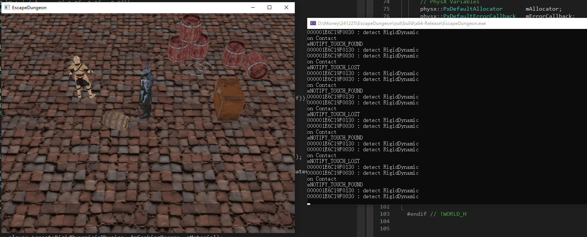

# Escape Dungeon

基于可编程管线OpenGL API实现的简单游戏交互界面，实现功能如下：

- 窗口显示与交互回调函数设置(窗口调整等)：GLFW库
- 相机设置与移动，当前设置为FOLLOW模式
- 常用模型导入与显示，带骨骼和动画的模型导入：ASSIMP库
  - 导入静态模型可使用obj，动态模型可用dae, fbx等
  - 支持动画播放的顶点着色器
  - 支持普通或Blinn-Phong光照模型的片段着色器（需与所选导入模型配合，当前未使用光照）
- 背景音乐和动作音效播放：IrrKlang库
- 物理效果模拟与碰撞检测：PhysX库
  - 使用静态刚体和动态刚体，玩家为运动学刚体




### 架构介绍

目录结构

```
|
|--- assets : 项目资源
|		|
|		|--- audios	: 音频
|		|--- objects: 模型
|		`--- shaders: 着色器代码
|
|---   src  : 项目主要代码
|		|
|		|--- animation	: Animator类用于动画播放，Animation类用于动画数据结构存储
|		|--- application: Application单例类，是应用窗口抽象
|		|--- camera		: Camera类，摄像机
|		|--- light		: Light类，暂无
|		|--- model		: Model类导入存储全模型，Mesh类存储每个网格数据结构，Bone类存储骨骼数据结构
|		|--- physics	: CollosionCB类，自定义PhysX库场景碰撞回调函数类
|		|--- shader		: Shader类，用于着色器编译构建与使用
|		|--- world		: World类代表世界，Object类为所有世界中物体的抽象，Player为特殊的Object
|		|
|		|- assimp2glm.h : ASSIMP和GLM库数学结构转换
|		|- common.h		: 基础头文件，引用常用的第三方库和标准库，通用全局定义，为所有类文件所引用
|		`- utils.h/.cpp	: 工具函数
|
|--- thirdparty : 针对win10构建并引用的第三方库
|		|
|		`--- dll 	: 动态链接库
|		`--- include: 头文件
|		`--- lib	: 静态链接库
|
|- main.cpp				: 程序主逻辑
|- main_derecated.cpp	: 旧时测试用逻辑，基本已经没用
`- CMakeLists.txt		: 项目通过CMake在Visual Studio 2022中管理
```

项目架构：基础设计参考LearnOpenGL，在此基础上进一步结构化和抽象化以遵循OOP变成原则，大体结构如图所示

​                                              

程序运行时，基本流程如图所示


### 注意事项

1. 基本操作方式
   - 键盘输入：WASD控制玩家，FOLLOW模式的相机移动
   - 鼠标移动：普通情况控制相机欧拉角，当前FOLLOW模式相机不响应
   - 鼠标滚轮：相机视角缩放
2. 项目使用方式
   - 打开Visual Studio 2022，选择"打开" → "CMake" 通过项目CMakeLists.txt打开项目
   - 调整到Release模式运行，项目MSVC编译器选项已经调至MT（GLFW库和PhysX库均以MT选项编译）
3. PhysX中运动学刚体和静态刚体之间的碰撞检测尚不成功：似乎触发回调函数的时机不对
4. 模型主要来源于Sketchfab，可从Blender中导出obj，不过需要注意将纹理解包出来并处理路径
5. 带动画的模型可以采用dae格式，但是我从Blender中新导出dae文件，渲染的顶点位置会很怪（看起来像是四元数顺序不匹配导致），当前版本的ASSIMP不支持Blender新导出的glb格式，经测试项目fbx格式的动画导入正常，因而主要使用fbx格式
6. 


### 第三方库和工具


